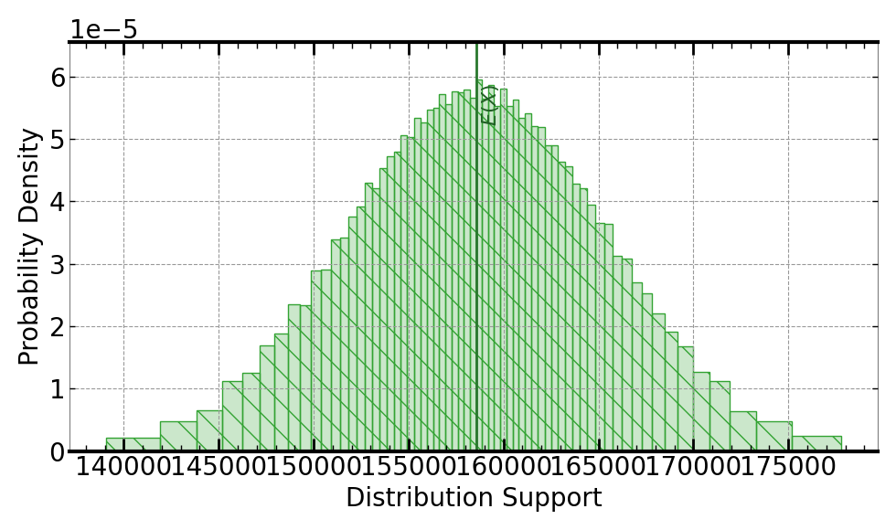
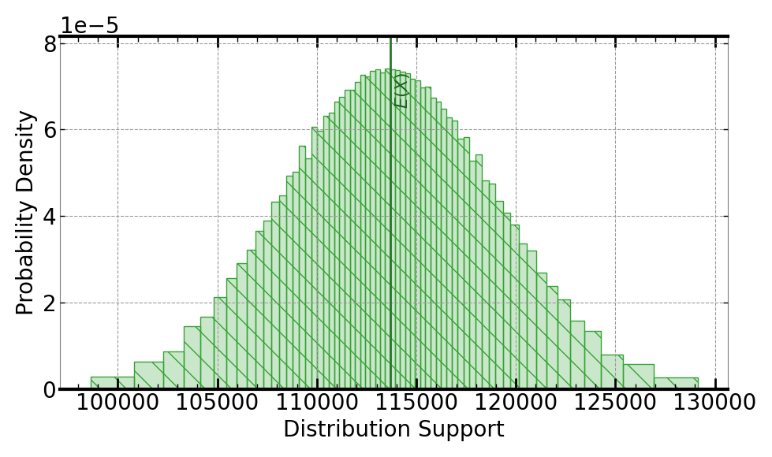

[](https://signaloid.io/repositories?connect=https://github.com/signaloid/Signaloid-Demo-Finance-InvestmentRetirementAccount#gh-dark-mode-only)
[](https://signaloid.io/repositories?connect=https://github.com/signaloid/Signaloid-Demo-Finance-InvestmentRetirementAccount#gh-light-mode-only)

# Personal Finance: Tax-Free Retirement Account (IRA) or Keogh Plan
The Tax-Free Retirement Account, commonly referred to as a Roth Individual Retirement Account (IRA), and the Keogh Plan are both tax-advantaged retirement savings accounts available in the United States. This example shows how uncertainty in the parameters of this model (e.g., annual contribution, tax rate, etc.) affect the future value of the account. The application calculates the total return of your tax-free investment and compares it with the return of a taxable investment scheme.

## Getting started
The correct way to clone this repository to get the submodules is:
```sh
	git clone --recursive git@github.com:signaloid/Signaloid-Demo-Finance-InvestmentRetirementAccount.git
```

If you forgot to clone with `--recursive` and end up with empty submodule directories, you can remedy this with:
```sh
	git submodule update --init
```

## Running the application on the Signaloid Cloud Developer Platform
To run this application on the [Signaloid Cloud Developer Platform](https://signaloid.io),
you need a Signaloid account. You can sign up for a Signaloid account using [this link](https://get.signaloid.io).

Once you have a Signaloid account, you can click the "add to signaloid.io" button at the
top of this `README.md` to connect this repository to the Signaloid Cloud Developer Platform
and run the application.

## Running the application locally
Apart from using Signaloid's Cloud Compute Platform, you can compile and run this application
locally. Local execution is essentially a native Monte Carlo implementation,
that uses GNU Scientific Library[^GSL] to generate samples for the different input distributions.
In this mode the application stores the generated output samples, in a file called `data.out`.
The first line of `data.out` contains the execution time of the Monte Carlo implementation
in microseconds (μs), and each next line contains a floating-point value corresponding to an output sample value.

In order to compile and run this application in the native Monte Carlo mode:

0. Install dependencies (e.g., on Linux):
```
sudo apt-get install libgsl-dev libgslcblas0
```
1. Compile natively (e.g., on Linux):
```
cd src/
gcc -O3 -I. -I/opt/local/include main.c kernel.c utilities.c common.c uxhw.c -L/opt/local/lib -o native-exe -lgsl -lgslcblas -lm
```
2. Run the application in the MonteCarlo mode, using (`-M`) command-line option:. We need to select a single output
when in MonteCarlo mode, so we print the taxable investment output here.
```
./native-exe -M 10000 -S 0
```
The above program runs 10000 Monte Carlo iterations.
3. See the output samples generated by the local Monte Carlo execution:
```
cat data.out
```

## Inputs

The inputs and their distributions are:
- $n$: The number of years to retirement.
- $t_i$: The total annual contribution to the account in the $i^\mathrm{th}$ year.
- $c_i$: The compounded annual interest rate in the $i^\mathrm{th}$ year.
- $r_i$: The assumed tax rate on interest in the $i^\mathrm{th}$ year.
- $w_i$: The withdrawal tax rate in the $i^\mathrm{th}$ year.

## Outputs

The output is the future value (FV) of the account at retirement.

### For an ordinary taxable investment:

The HP 12C Platinum Solutions Handbook[^1] provides the formula for the ordinary taxable investment as

```math
FV = \frac{t}{c(1-r)} \left[1 + c(1-r) \right] \biggl\{ \left[1 + c(1-r) \right]^n - 1 \biggr\}.
```

This formula is only useful when the input variables are constant over the years until retirement.
To be able to account for the input variables that vary over the years, the equivalent formula
one should use is

```math
FV = \sum\limits_{i = 1}^n t_i \prod\limits_{k=i}^n \left[1 + c_k (1 - r_k) \right].
```

Following is an example output for an ordinary taxable investment, using Signaloid's C0Pro-S core, for the default inputs:



### For a tax-free investment:

The HP 12C Platinum Solutions Handbook[^1] provides the formula for a tax-free investment as

```math
FV = \frac{(1-w) * t}{c} (1 + c) \biggl\{ \left[1 + c \right]^n - 1 \biggr\}.
```

This formula is only useful when the input variables are constant over the years until retirement.
To be able to account for the input variables that vary over the years, the equivalent formula
one should use is

```math
FV = \sum\limits_{i = 1}^n (1 - w_i) t_i \prod\limits_{k=i}^n (1 + c_k).
```

Following is an example output for a tax-free investment, using Signaloid's C0Pro-S core, for the default inputs:



## Usage
```
Example: Personal Finance: Tax-Free Retirement Account (IRA) or Keogh Plan - Signaloid version

Usage: Valid command-line arguments are:
        [-o, --output <Path to output CSV file : str>] (Specify the output file.)
        [-S, --select-output <output : int> (Default: 0)] (Compute 0-indexed output.)
        [-M, --multiple-executions <Number of executions : int> (Default: 1)] (Repeated execute kernel for benchmarking.)
        [-T, --time] (Timing mode: Times and prints the timing of the kernel execution.)
        [-b, --benchmarking] (Benchmarking mode: Generate outputs in format for benchmarking.)
        [-j, --json] (Print output in JSON format.)
        [-h, --help] (Display this help message.)
        [-n, --number-of-years <The number of years to retirement : int in [0, inf)> (Default: 20)]
        [-c, --compounded-annual-interest-rate <The compounded annual interest rate expressed as a percentage: double> (Default: Uniform(0.5, 1.0))]
        [-t, --total-annual-contribution-to-account <The total annual contribution to the account : double> (Default: Uniform(5000.0, 10000.0))]
        [-r, --assumed-tax-rate-on-interest <The assumed tax rate on interest expressed as a percentage : double> (Default: Uniform(20.0, 40.0))]
        [-w, --withdrawal-rate <The withdrawal rate expressed as a percentage : double> (Default: Uniform(20.0, 40.0))]
```


<br/>
<br/>
<br/>

[^GSL]: [GNU Scientific Library](https://www.gnu.org/software/gsl/).

[^1]: HP 12C Platinum Solutions Handbook, Appendix B, page 164.
